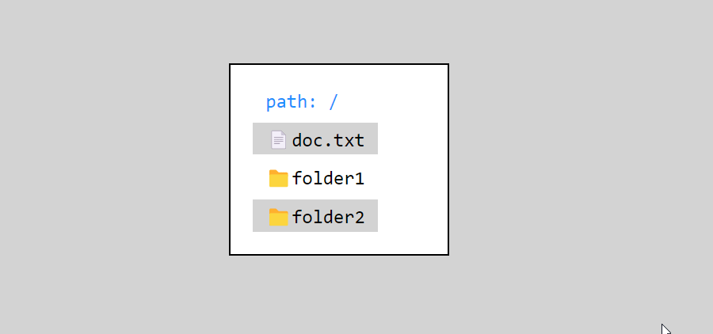

# Simple File Manager

  

Teches: React, Express.
 
 
Notes:
1) backend get files from `be/root/file` folder.
2) app listen ports: `fe - 3000` and `be-8000`

### How to start:
1) `git clone`
2) `npm run-script install-be`
3) `npm run-script install-fe`
4) `npm run-script start`

## Demo
